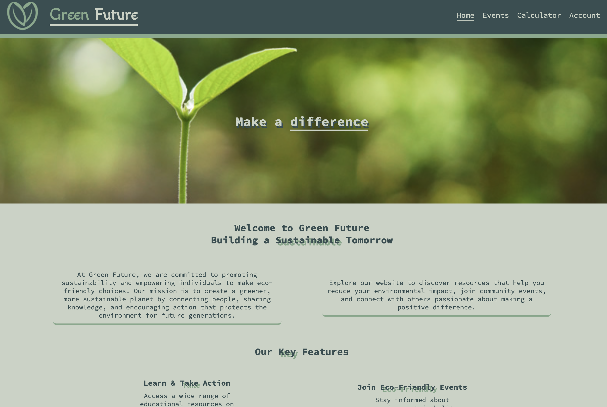
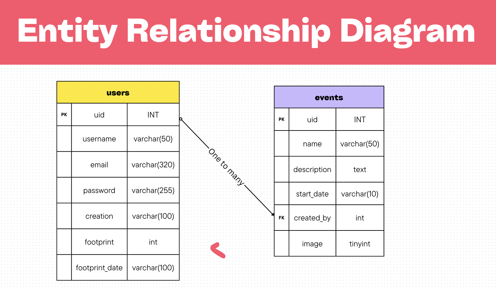

# Netherlands Project Assignment!

This has been my biggest and most challenging project done so far, and it has given me a (nearly) full web application!

This web application is for a fake company named 'green future' and allows users to navigate through the company's website, and also allows them to create new events for anyone to attend.

This is the first project I have done using databases and php, as well as the first time I have implemented accoounts and authentication.

## Features

- Users can create events
- Users can view events
- Users can take a carbon footprint calculator test
- Users have this information stored on their account and is saved until a new test is done.

## Not completed that I wanted to do

- Users can edit their own events
- Users can join other events
- Users can delete events
- Users can view carbon footprint history
- Users discoverable by other users!
- Improved UI for carbon footpring calculator
- More options on the accounts page
- See what users have joined events
- Chat features for event groups (maybe one day)

## What I have learned

- PHP!
- Database integration
- Responsive design
- UI navigation with JavaScript
- Wamp servers
- SQL
- MySQL

## Setting up the project yourself

If for some reason you want to set up and run this web app yourself, you will need to do the following:

1. Download and install a Wamp server (i used XAMPP)
2. Download and install PHP
3. Clone this repository
4. On phpmyadmin (or through some other way) create a database called 'green_future
5. Follow this layout for the tables:

6. Run the project on your local server
